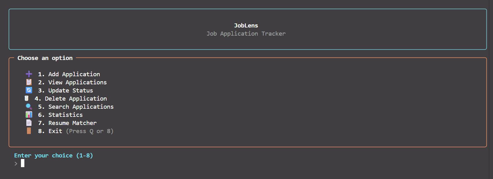
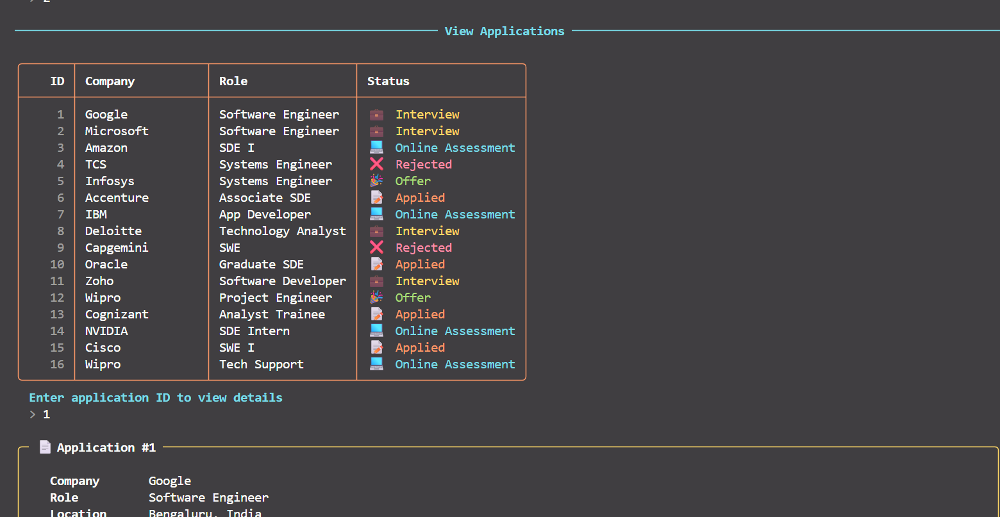
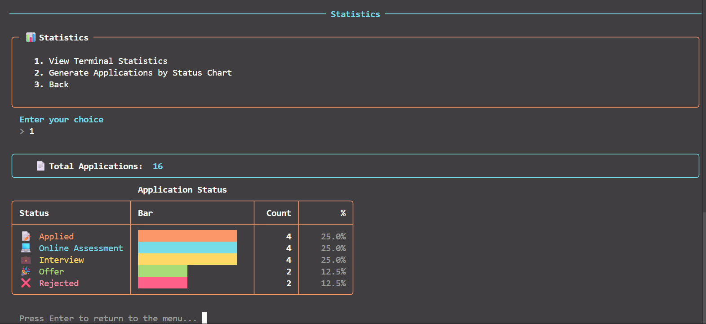
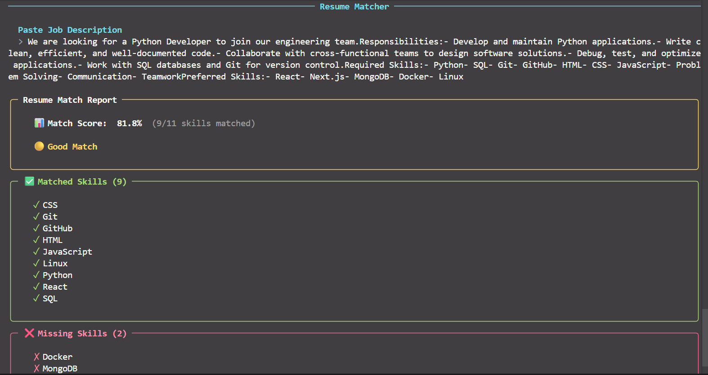

# JobLens

#### Video Demo: https://youtu.be/Oa-S7ZLmMcs?si=NcJKvpjNyIFh-O6P
The video demo is of v1, check the screenshots for v2.

<!-- TODO: Re-record demo video to show the updated Rich terminal UI -->
**v2** — Enhanced with a Rich-powered terminal UI after course submission.


#### Description

JobLens is a command-line job application tracker built with Python as my final project for CS50’s Introduction to Programming with Python (CS50P).

I created this project because keeping track of my own job applications, interview stages, and job links became difficult. JobLens allows users to store and manage job applications, search existing records, view application statistics, and compare their resume with a job description using a simple resume matcher.

My goal was to build a practical application that combines object-oriented programming, JSON file handling, testing with `pytest`, and modular Python design into a project that I can continue using and improving even after completing CS50P.


## Screenshots


The main menu and welcome screen.


Viewing saved applications in a color-coded table.


Terminal statistics dashboard.


Resume-to-job-description match report.


## Features

### Add Applications

Users can store information about job applications, including:

* Company name
* Job role
* Location
* Date applied
* Current application status
* Job link
* Notes

Each application is assigned a unique ID for easy management.

### View Applications

All saved applications are displayed in a formatted table, allowing users to quickly review their job search progress. There's also a detailed view that shows all the details.

### Update Status

Users can update the status of an existing application. Supported statuses include:

* Applied
* Online Assessment
* Interview
* Offer
* Rejected

Input validation ensures that only valid statuses are accepted.

### Delete Applications

Applications can be removed using their unique ID.

### Search

Users can search applications by company, role, location, or status, making it easier to find specific records.

### Resume Matcher

One of the main features of JobLens is its resume matcher.

The program extracts text from a PDF resume using the pypdf library. It compares the skills found in the resume with skills detected from the provided job description and generates a simple match report.

The matcher displays:

* Match percentage
* Matching skills
* Missing skills

This provides a quick estimate of how closely a resume aligns with a job posting.

### Statistics

JobLens generates statistics showing how applications are distributed across different stages of the hiring process.

Statistics include:

* Total applications
* Count for each application status
* Percentage breakdown
* Terminal-based bar chart

### Visualization

In addition to terminal statistics, JobLens can generate a bar chart using Matplotlib, providing a visual summary of application progress.

### Terminal Interface

The terminal output uses the [Rich](https://github.com/Textualize/rich) library for a cleaner, more readable experience. This is a styling layer only — no new functionality was added. The changes include:

* Bordered panels and tables with a rounded box style, replacing plain text output.
* Color-coded application statuses: Applied (blue), Online Assessment (cyan), Interview (yellow), Offer (green), Rejected (red).
* Consistent message styling using ✓ (success), ✗ (error), ⚠ (warning), and ℹ (info) indicators.
* Styled input prompts with automatic fallback to plain `input()` when stdin is piped (for compatibility with automated testing).
* UTF-8 output is forced explicitly so that box-drawing characters render correctly on Windows terminals.

## Project Structure

```
project/
│
├── project.py
├── resume_matcher.py
├── ui.py
├── test_project.py
├── applications.json
├── skills.json
├── requirements.txt
├── README.md
└── resume/
    └── NILESH_CHIDAMBARAM_Resume.pdf
```

## Design Choices

### Why JSON?

I chose JSON to store application data because it is simple, lightweight, and built into Python. Since this is a command-line application, using JSON made more sense than setting up a database. It also allows the user's applications to be saved between sessions while remaining easy to read and edit if needed.

### Why Object-Oriented Programming?

I decided to represent each application as a `JobApplication` object instead of using plain dictionaries throughout the program. This keeps the application's data and validation in one place and made methods like `to_dict()` and `from_dict()` easier to implement. It also made the code more organized as the project grew.

### Why a Separate Resume Matcher Module?

When I first started building the project, all of the code was inside `project.py`. As I added the resume matching feature, the file became much larger and harder to navigate. I moved the resume matching logic into its own module (`resume_matcher.py`) so that each file had a single responsibility. This separation made the project cleaner, easier to maintain, and easier to test.

### Why a Separate UI Module?

The same reasoning applies to `ui.py`. When I upgraded the terminal output to use Rich, I wanted to keep all rendering code — panels, tables, color definitions, styled prompts — in one place rather than scattering Rich calls throughout `project.py` and `resume_matcher.py`. This way, the main files stay focused on business logic, and the interface can be restyled without touching any data handling or validation code.

### Why Matplotlib?

The terminal statistics already provide useful information, but I wanted to include a graphical representation of the data as well. Matplotlib allowed me to generate a simple bar chart showing the distribution of job application statuses. I kept this feature optional so users can choose between a quick terminal summary or a visual overview.

## Testing

The project includes automated tests written with `pytest`. Instead of testing the interactive menu, I focused on testing the core logic of the application.

The test suite covers:

* Creating `JobApplication` objects
* Input validation
* Serialization with `to_dict()` and `from_dict()`
* JSON file loading and saving

Testing the application's core functionality helped ensure that the most important parts of the project work correctly and continue to behave as expected after making changes.


## Libraries Used

### Standard Library

* os
* json
* sys
* datetime

### Third-Party Libraries

* pypdf
* matplotlib
* rich (used for terminal rendering)
* pytest (used for testing)


## Future Improvements

Although JobLens is complete, there are several possible enhancements, namely a few I think I'll do:

* Smarter skill matching using aliases and synonyms.
* Keyword extraction instead of exact text matching.
* Resume ranking against multiple job descriptions.
* CSV import/export.
* Database support using SQLite.
* A graphical user interface.

## Updates

**v2** — Upgraded the terminal interface using the Rich library
(bordered panels, tables, color-coded statuses, styled prompts).
Presentation only — all original logic, data structures, and menu
behavior are unchanged. Also fixed two minor bugs found during this
pass: search by location/status was incorrectly matching on role,
and the resume matcher only read the last page of multi-page PDFs.

**v1** — Original CS50P submission.

## What I Learned


This project helped me apply many of the concepts I learned throughout CS50P, including object-oriented programming, JSON handling, exception handling, and testing with `pytest`.

One of the biggest challenges was keeping the project organized as it grew. Separating the resume matcher into its own module made the code much cleaner, and I also became more confident writing structured code and choosing better variable and function names.

Building the resume matcher and writing automated tests were the most enjoyable parts of the project because they challenged me to apply concepts beyond simply storing and managing data.

The UI upgrade was a good exercise in separating concerns. I wanted the terminal output to look more polished — partly for readability, partly because I use this tool myself and wanted it to feel nicer — so I constrained myself to presentation-only changes: no logic modifications, no new features, just a cleaner interface. Extracting all rendering into `ui.py` made this much easier than I expected, and reinforced the value of keeping display code separate from business logic.

Overall, this project was a great learning experience. Thank you to the entire CS50 team for creating such an amazing course—it has been an incredible journey!
